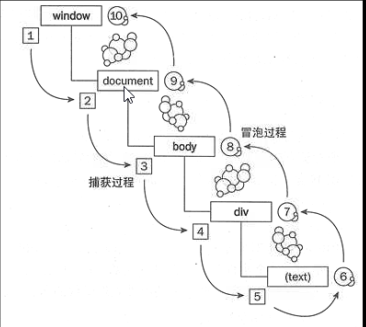

事件
---
####事件绑定

1. 只有在事件触发时才会执行事件里的代码
2. 优点：
    + w3c标准结构表现行为三者分离
    + 结构清晰，方便维护
    + 处理更多细节

####事件列表 
1. 鼠标事件
    * onmouseover:鼠标移入事件
    * onmouseout:鼠标移出事件
    * onmousemove:鼠标移动事件
    * onmouseup:鼠标被松开的时候触发事件
    * onmousedown:鼠标被按下的时候触发事件
    * onclick:鼠标单击事件
    * ondbclick:鼠标双击事件，相当于两次鼠标单击事件
    * oncontextmenu:鼠标右键菜单展开时触发
    ps:click = mousedown + mouseup

2. 键盘事件
    * onkeydown:某个键盘按键被按下 判断按下的按键
    * onkeyup:某个键盘按键被松开
    * onkeypress:键盘字符键被按下 输入的字符时用
3. 其他事件
    * onchange:当元素内容改变时，触发相应的事件
        element.onchange=function()
    * onblur:失去焦点事件
    * onfocus:获得焦点事件
    * onreset:重置按键被点击
    * onselect:文本被选中
    * onsubmit:确认按键被点击
    * onabort:图像的加载被中断
    * onerror:在加载文档或图像时发生错误
    * onload:页面元素加载完成后
    * onunload:用户退出页面
    * onresize:窗口大小被改变时

####event对象
1. 事件执行过程中的状态，用来保存当前事件的信息
2. 如何获取event对象
    标准：事件处理函数的第一个参数
    IE8-    :window.event
    IE8-：document.attachevent是否为true

####坐标
+ clientX、clientY  鼠标相对于浏览器可视区域的位置，也就是浏览器坐标
+ pageX、pageY 鼠标相对与文档的位置（包括滚动条滚动的距离   
    clientX+document.body.scrollLeft，IE不支持
    **兼容的写法：**
    e.pageX= e.pageX || e.clientX+scrollLeft;
    e.pageY= e.pageY || e.clientX+scrollTop;
+ screenX、screenY 鼠标相对于电脑屏幕的位置，用处不是很大
+ offsetX、offsetY 鼠标相对于事件源对象的偏移量

####事件冒泡
**概念**
    在一个对象上触发某类事件（如onclick事件），那么click事件就会向这个对象的父级传播，从里到外，直至它被处理程序处理，或者事件到达了最顶层（document/window）

**利用**

+ e.target 事件源对象，可通过tagName或其他来进行筛选。
 
**阻止事件冒泡**

+ 标准：event.stopPropagation();
+ IE8-：event.cancelBubble = true; 一个属性 

**阻止浏览器的默认行为**

默认行为有：**链接跳转**、**表单提交**、**右键菜单**等
+ 标准：event.preventDefault();
+ IE8-：event.returnValue = false;

####多事件绑定实现
+ 先取值后赋值
    例 

####事件监听
1. 生成事件监听器
   **标准**: target.addEventListener(type, fn, capature);

    + type:事件名(不包括on的事件名称，如click,mouseover,等)
    + fn:事件处理函数
    + capature:是否捕获(反向冒泡)，布尔值(true||false)

    **IE8-**:target.attachEvent(type,fn);

    + type:包含on的事件名称，如onclick、onmouseover等
    + 不支持事件捕获

2. 捕获与冒泡的过程:
    
    
   

